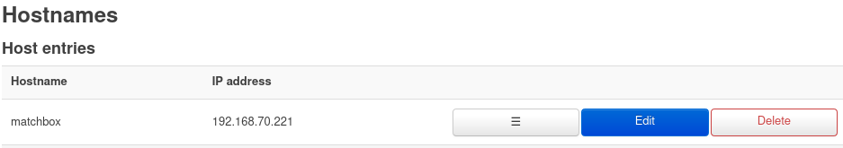
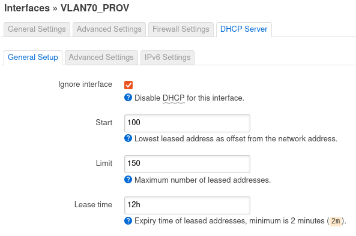
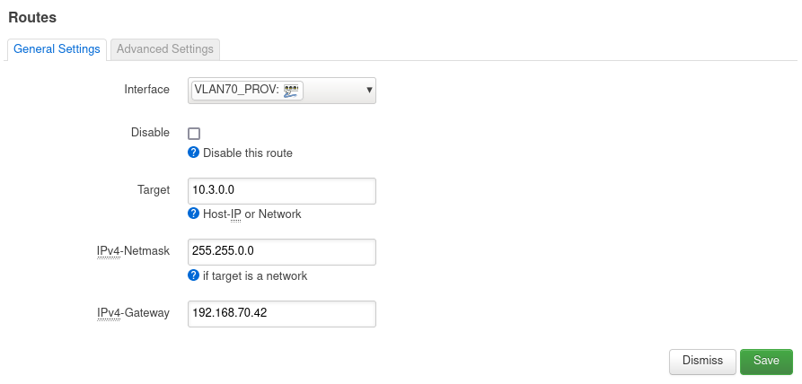

# Kubernetes baremetal cattle

Most of this is compiled from the following projects with a personal touch.

<https://matchbox.psdn.io/>

<https://typhoon.psdn.io>

## Overview

The goal is to get to a point where I can just plugin a new machine and have it autoprovision with all the services I need in my _home production environment_.

Work in progress.

### Hardware

- Alix PC Engines APU2C4 as my router, running OpenWRT.
- Gigabit Fibre connection.
- Juniper EX2200-24p-POE.
- RPI4 4GB with PoE hat as my iPXE boot machine, which services the kubernetes VLAN.
- Thinkpad T590 laptop as my single node k8S cluster, planning to expand this in the future to have multiple nodes.
- Separate NFS Storage on a server which I will rebuild later.

## Install Raspbian arm64 lite

Use RPI Imager, make sure you set SSH enabled & hostname, pubkey etc..
Once the SDCard is ready, pop it into the RPI4 and boot it up.

You should be able to SSH into your hostname, using your SSH keys.

Install useful packages

```shell
sudo apt install -y lsof screen tcpdump vim
```

## Set static IP

```shell
sudo vim /etc/dhcpcd.conf
```

Uncomment the following:

```shell
# Example static IP configuration:
interface eth0
static ip_address=192.168.70.221/24
static routers=192.168.70.1
static domain_name_servers=192.168.70.1
```

## Install Docker

```shell
sudo apt-get update && sudo apt-get upgrade
curl -fsSL https://get.docker.com -o get-docker.sh
sudo sh get-docker.sh
sudo usermod -aG docker maha
```

## Router

I have a separate Provisionig VLAN where all this takes place, so it does not interfere with the rest of the network.

On your router ensure you have a static entry so that `matchbox.maha.nz` resolves to your RPI4.



Disable DHCP on the router (for the PROV Interface/VLAN) as we will run the RPI4 as the DHCP/TFTP server on this subnbet.



Add a Static Route in OpenWRT for your K8S service subnet



## Matchbox

### Provisioner

Download Latest

```shell
wget https://github.com/poseidon/matchbox/releases/download/v0.9.0/matchbox-v0.9.0-linux-amd64.tar.gz
wget https://github.com/poseidon/matchbox/releases/download/v0.9.0/matchbox-v0.9.0-linux-amd64.tar.gz.asc
```

Verify signature

```shell
gpg --keyserver keyserver.ubuntu.com --recv-key 2E3D92BF07D9DDCCB3BAE4A48F515AD1602065C8
gpg --verify matchbox-v0.9.0-linux-amd64.tar.gz.asc matchbox-v0.9.0-linux-amd64.tar.gz
gpg: Good signature from "Dalton Hubble <dghubble@gmail.com>"
```

### Generate TLS Certificates

The Matchbox gRPC API allows clients (terraform-provider-matchbox) to create and update Matchbox resources.
TLS credentials are needed for client authentication and to establish a secure communication channel.
Client machines (those PXE booting) read from the HTTP endpoints and do not require this setup.

The cert-gen helper script generates a self-signed CA, server certificate, and client certificate. Prefer your organization's PKI, if possible.

Navigate to the scripts/tls directory.

```shell
cd scripts/tls
```

Export SAN to set the Subject Alt Names which should be used in certificates.
Provide the fully qualified domain name or IP (discouraged) where Matchbox will be installed.

DNS or IP Subject Alt Names where matchbox runs

```shell
export SAN=DNS.1:matchbox.maha.nz,IP.1:192.168.70.221
```

Generate a ca.crt, server.crt, server.key, client.crt, and client.key.

```shell
./cert-gen
```

Move TLS credentials to the matchbox server's default location.

```shell
useradd matchbox
sudo mkdir -p /etc/matchbox
sudo cp ca.crt server.crt server.key /etc/matchbox
sudo chown -R matchbox:matchbox /etc/matchbox
```

Download these to your local machine (where you will be running Terraform)
Save client.crt, client.key, and ca.crt for later use (e.g. ~/.matchbox).

```shell
mkdir -p ~/.config/matchbox
scp matchbox:~/{client.crt,client.key,ca.crt} ~/.config/matchbox/
```

### Download Images (Cached install)

Matchbox can serve OS images in development or lab environments to reduce bandwidth usage and increase the speed of PXE boots and installs to disk.

Download a recent Fedora CoreOS or Flatcar Linux release.

```shell
mkdir -p /var/lib/matchbox/assets
cd /var/lib/matchbox/assets
sudo ~/matchbox-v0.9.0-linux-amd64/scripts/get-flatcar stable 3033.2.4 .
```

## Start Prov services

Run `poseidon/dnsmasq` container as your DHCP/TFTP server.
Ensure DHCP Option 3 is still your router (default gateway) otherwise your client won't be able to get to the internet when booting with iPXE

```shell
sudo docker run --rm --cap-add=NET_ADMIN --net=host quay.io/poseidon/dnsmasq:v0.5.0-11-g3631556-arm64 \
  -d -q \
  --dhcp-range=192.168.70.3,192.168.70.150 \
  --dhcp-option=3,192.168.70.1 \
  --dhcp-host=98:fa:9b:ef:2d:28,192.168.70.42 \
  --enable-tftp --tftp-root=/var/lib/tftpboot \
  --dhcp-match=set:bios,option:client-arch,0 \
  --dhcp-boot=tag:bios,undionly.kpxe \
  --dhcp-match=set:efi32,option:client-arch,6 \
  --dhcp-boot=tag:efi32,ipxe.efi \
  --dhcp-match=set:efibc,option:client-arch,7 \
  --dhcp-boot=tag:efibc,ipxe.efi \
  --dhcp-match=set:efi64,option:client-arch,9 \
  --dhcp-boot=tag:efi64,ipxe.efi \
  --dhcp-userclass=set:ipxe,iPXE \
  --dhcp-boot=tag:ipxe,http://matchbox.maha.nz:8080/boot.ipxe \
  --address=/matchbox.maha.nz/192.168.70.221 \
  --log-queries \
  --log-dhcp
```

Run `poseidon/matchbox` container

```shell
sudo docker run --net=host --rm -v /var/lib/matchbox:/var/lib/matchbox:Z -v /etc/matchbox:/etc/matchbox:Z,ro quay.io/poseidon/matchbox:v0.9.0-114-g0b073d7-arm64 -address=0.0.0.0:8080 -rpc-address=0.0.0.0:8081 -log-level=debug
```

Matchbox will serve files from your `/var/lib/matchbox` folder over HTTP & the gRPC port can be used by Terraform to deploy your configuration.

## Terraform

Deploy the Matchbox configuration via Terraform.
Ensure you have the client key and certificates in `~/.config/matchbox`

### Write

Create a new folder/project (or clone existing)

This is what we aim for

```shell
├── .gitignore
├── kratos.tf
├── outputs.tf
├── providers.tf
└── remote.tf
```

- `providers.tf`

Ensure you have the right client certificates and gRPC endpoint configured

```hcl
provider "matchbox" {
  endpoint    = "matchbox.maha.nz:8081"
  client_cert = file("~/.config/matchbox/client.crt")
  client_key  = file("~/.config/matchbox/client.key")
  ca          = file("~/.config/matchbox/ca.crt")
}

provider "ct" {}

terraform {
  required_providers {
    ct = {
      source  = "poseidon/ct"
      version = "0.10.0"
    }
    matchbox = {
      source = "poseidon/matchbox"
      version = "0.5.0"
    }
    azurerm = {
      source = "hashicorp/azurerm"
      version = "3.0.2"
    }
  }
}
```

- `remote.tf`

We keep the Terraform state in an Azure Storage Account

```hcl
terraform {
  backend "azurerm" {
    storage_account_name = "kratoshomelab"
    container_name       = "tfstate"
    key                  = "kratos.tfstate"
  }
}
```

> NOTE - We will pass the storage account access key during terraform init later

- `kratos.tf`

Define your Kubernetes infrastructure.
Make sure to set a reference in the module source so you don't have everything update when you apply next time and it pulls a more recent release (append `?ref=RELEASE OR COMMIT ID`)

```hcl
module "kratos" {
  source = "git::https://github.com/poseidon/typhoon//bare-metal/flatcar-linux/kubernetes?ref=v1.23.5"

  # bare-metal
  cluster_name            = "kratos"
  matchbox_http_endpoint  = "http://matchbox.maha.nz:8080"
  os_channel              = "flatcar-stable"
  os_version              = "3033.2.4"

  # configuration
  k8s_domain_name    = "kube.maha.nz"
  # your PUBLIC key here
  ssh_authorized_key = "ssh-rsa AAAAB3NzaC1yc2EAAAADAQABAAABAQDE9fwuzJoGToSn9R43CVuC8J+Xieyqf3Kuec59movPTb7mV4R8WTMkhV6F16F8fQP76wamCAS2l6GPxd8Qn1xLIyVPqB7ffrSEWL8UYloGNrMcTHIFXwZtqXZqeKjD2r6lqwOaJgnJoJiORK/ooYbSoklFZcEsY/tJmcb6f3aaS928CRLZBdeM+vXdx+j9x0rSTT+zaScnZ3yEFzDPTB2AIE5bBNS9Nazy9bM9up36JnxUVMXqtkyRoXknAYkracAVhjI1WNxlPZ1/pRAJb3YvmxoQnoz+0a1IJk7hzHgUJGxqb7elN5XkmL60uT4ZrNS4UvWPGMKSpFcxEwSOSnaN"
  # Cached install means it will use the files we downloaded earlier in the Matchbox assets folder
  cached_install = true
  # This defaults to /dev/sda not useful when you have an NVME drive
  install_disk = "/dev/nvme0n1"
  # Set your service CIDR, this is what you are creating a static route for on the router
  service_cidr = "10.3.0.0/16"
  # machines
  controllers = [{
    name   = "kube"
    # MAC address of the client you will boot via iPXE, this is your selector.
    mac    = "98:fa:9b:ef:2d:28"
    domain = "kube.maha.nz"
  }]
  workers = [
    # {
    #   name   = "node2",
    #   mac    = "52:54:00:b2:2f:86"
    #   domain = "node2.example.com"
    # },
    # {
    #   name   = "node3",
    #   mac    = "52:54:00:c3:61:77"
    #   domain = "node3.example.com"
    # }
  ]

  # set to http only if you cannot chainload to iPXE firmware with https support
  download_protocol = "http"
}
```

- `outputs.tf`

We will save the new K8S cluster config so we can access with `kubectl`

```hcl
resource "local_file" "kubeconfig-kratos" {
  content  = module.kratos.kubeconfig-admin
  filename = "/home/maha/.kube/configs/kratos-config"
}
```

- `.gitignore`

```shell
# .gitignore
*.tfstate
*.tfstate.backup
.terraform/
```

### Deploy

Initialize the config directory if this is the first use with Terraform.

```shell
terraform init -backend-config="access_key=YOUR_AZURE_STORAGE_ACCOUNT_ACCESS_KEY"
```

Plan the resources to be created.

```shell
terraform plan
```

Apply the changes. Terraform will generate bootstrap assets and create Matchbox profiles (e.g. controller, worker) and matching rules via the Matchbox API.

```shell
terraform apply
```

Apply will then loop until it can successfully copy credentials to each machine and start the one-time Kubernetes bootstrap service.
**Proceed to the next step while this loops.**

Power on your client, bring up boot menu (F12) and select PXE/iPXE boot.

Wait ~5 minutes and you should have a K8S cluster running.

### Verify

```shell
export KUBECONFIG=/home/maha/.kube/configs/kratos-config
```

```shell
$ kubectl get nodes
NAME           STATUS   ROLES    AGE     VERSION
kube.maha.nz   Ready    <none>   7h20m   v1.23.5
```

Remove taint on the controller if you are running a single node cluster.

```shell
kubectl taint node kube.maha.nz node-role.kubernetes.io/controller-
```

## TODO

- Monitoring stack via Terraform
- *arr stack via Terraform
- Figure out nginx ingress controller setup

## Troubleshooting

Check you can reach the endpoint

```shell
maha@omar:~$ curl http://matchbox.maha.nz:8080/boot.ipxe
#!ipxe
chain ipxe?uuid=${uuid}&mac=${mac:hexhyp}&domain=${domain}&hostname=${hostname}&serial=${serial}
```

Get a shell inside your container

```shell
docker run --rm -it --entrypoint sh quay.io/poseidon/dnsmasq:v0.5.0-11-g3631556-arm64
```

Check gRPC is reachable

```shell
openssl s_client -connect matchbox.maha.nz:8081 \
  -CAfile ~/.config/matchbox/ca.crt \
  -cert ~/.config/matchbox/client.crt \
  -key ~/.config/matchbox/client.key
```

Disable sleep on lid close (I am running this on a laptop)

`/etc/systemd/logind.conf`

```shell
HandleLidSwitch=ignore
```
